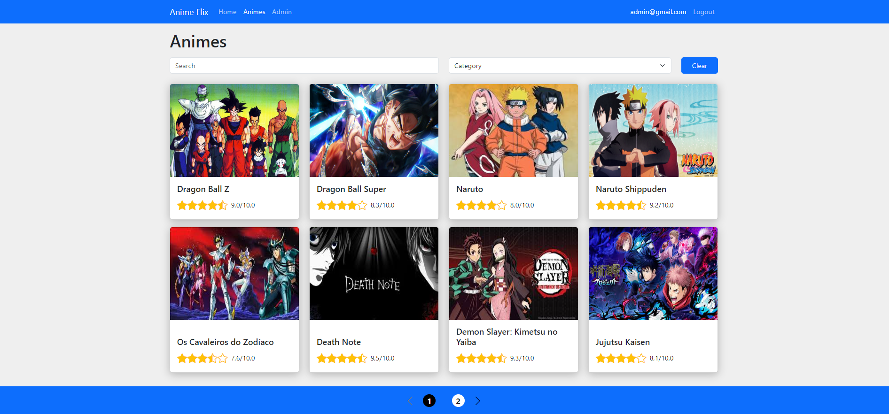
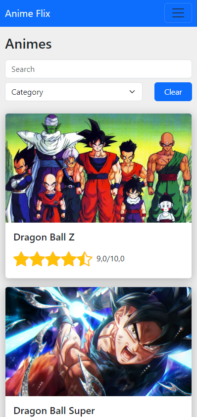
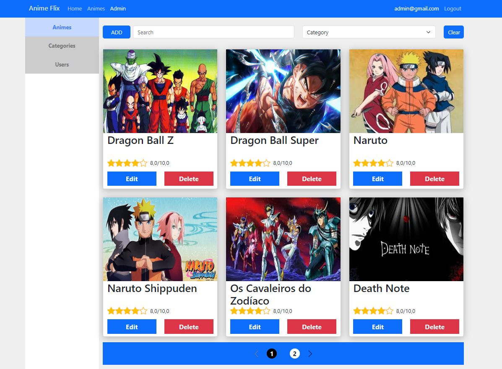
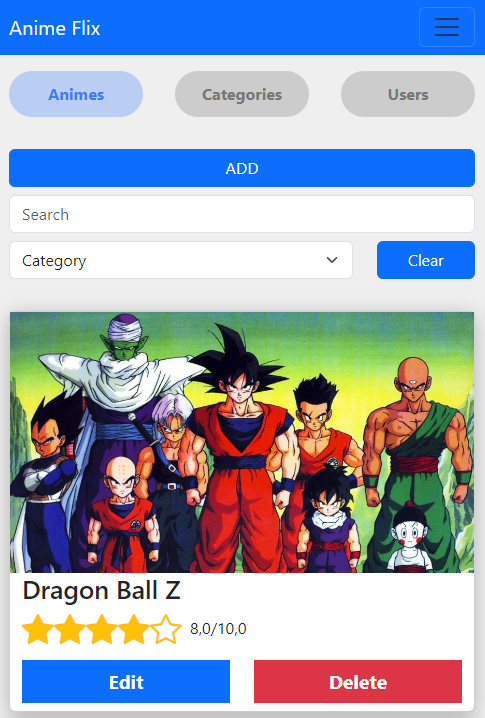
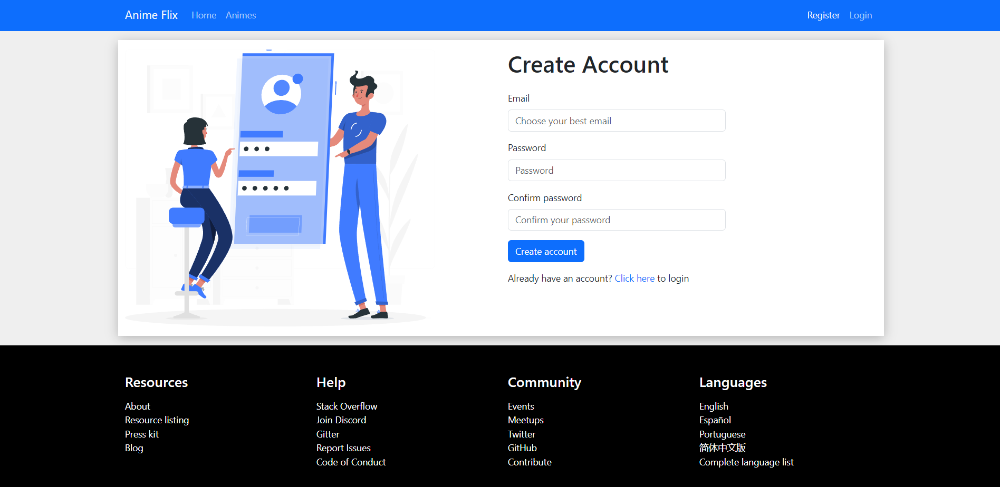
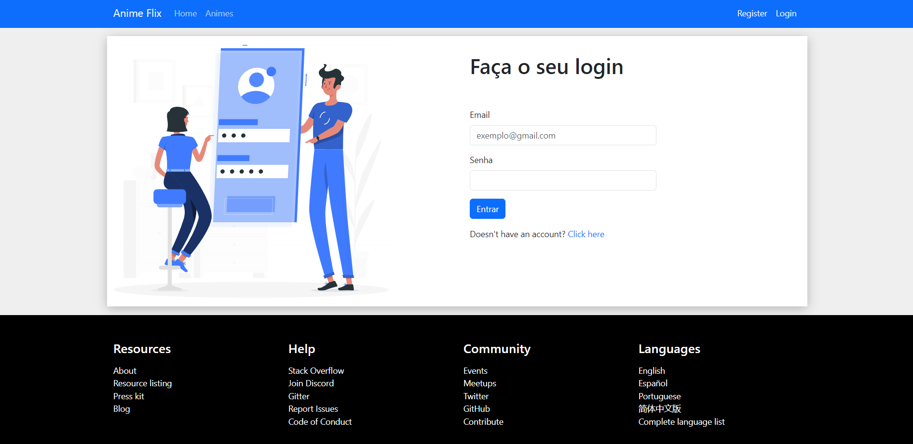

# AnimeFlix Frontend

## Requirements
* Node 18
* Npm 9.8
* Make sure you already setup the backend, following the instructions [here](https://github.com/Fronchak-Projects/Animeflix-Backend)

## How to Use
1. Clone this project to your machine
2. Open your terminal in the project's folder
3. Run the following command: 'npm install' to install all the dependencies
4. Run 'npm run dev' to initialize the project
5. Make sure that the backend is running, otherwise, the connection will fail
6. Open your browser in the 'http://localhost:5173' to see the home page

## Images

### Animes Pagination

### Animes Pagination (Mobile)

### Admin Animes Pagination

### Admin Animes Pagination (Mobile)

### Register Page

### Login Page

